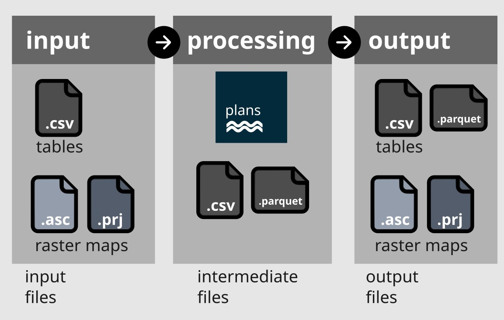

.. image:: ./figs/logo.png
    :width: 150 px
    :align: center
    :alt: Logo

############################################
I/O Reference
############################################

This is the Input and Output reference documentation of ``plans`` tool.

.. toctree::
   iofiles

********************************************
Overview
********************************************

As shown bellow, the ``plans`` model Input/Output workflow is
quite straight forward. There are three types of files:

- :ref:`Input Files<io-input-files>`;
- :ref:`Intermediate Files<io-interm-files>`, and;
- :ref:`Output Files<io-output-files>`;

The only bottle neck in the process is to prepare input files
in the right format.

   Input/Output overview in ``plans``.

.. _io-data-struct:

********************************************
Data structures
********************************************

Files used in ``plans`` are related to the following two data structures:

- :ref:`Table<io-table>`
- :ref:`Raster map<io-raster>`

A :ref:`Table<io-table>` can store a frame of data in rows and columns in a single file.
A :ref:`Raster map<io-raster>` can store a map grid in a matrix of numbers in a single file.
Extra files may be required for complete information about the map.

Input files must be formatted in by standard way, otherwise the tool is not going to work.
The standards are meant to be simple and user-friendly for any human and Operating System.
All kinds of files can be opened and edited by hand in Notepad-like applications.
They are described below.

.. _io-table:

Table
============================================

A **table** in ``plans`` is a frame of data defined by rows and columns.
Each column represents a **field** that must be *homogeneous*.
This means that each field stores the same **data type**, like text,
datetime, integer numbers or real numbers.
The first row stores the names of the fields. The subsequent rows stores
the data itself.

For input tables it must follow this general rules:

- the file must be a plain file with ``.csv`` or ``.txt`` extension
- semi-column ``;`` must be the separator of columns
- period ``.`` must be the separator of decimal places for real numbers

For example, in the following table ``Id`` is an integer-number field,
``NDVI_mean`` is a real-number field and the remaining are text fields.

.. code-block::

   Id;     Name; Alias;    Color;  NDVI_mean
    1;    Water;     W;     blue;       -0.9
    2;   Forest;     F;    green;       0.87
    3;    Crops;     C;  magenta;       0.42
    4;  Pasture;     P;   orange;       0.76
    5;    Urban;     U;   9AA7A3;       0.24

.. note::

    **No need for column alignment**. ``plans`` is *not* sensitive
    to *spaces* in table ``txt`` files. Hence, columns in table files
    can be either beautifully aligned like the above example or
    compacted like the following:

    .. code-block::

        Id;Name;Alias;Color;NDVI_mean
        1;Water;W;blue;-0.9
        2;Forest;F;green;0.87
        3;Crops;C;magenta;0.42
        4;Pasture;P;orange;0.76
        5;Urban;U;9AA7A3;0.24

.. _io-timeseries:

Time series
--------------------------------------------

A :ref:`Time Series<io-timeseries>` in ``plans`` is a special kind of :ref:`Table<io-table>` file
which must have a ``Datetime`` field (generally in the first column).
The ``Datetime`` field is a text field that stores dates in the format
``yyyy-mm-dd HH:MM:SS.SSS`` (year, month, day, hour, minute and seconds).
The other fields generally are real number fields that stores the state
of *variables* like precipitation ``P`` and temperature ``T``.

Time series files tends to have a large number of rows. The first 10 rows
of a time series file looks like this:

.. code-block:: text

                  Datetime;    P;    T
   2020-01-01 00:00:00.000;  0.0; 20.1
   2020-01-02 00:00:00.000;  5.1; 24.3
   2020-01-03 00:00:00.000;  0.0; 25.8
   2020-01-04 00:00:00.000; 12.9; 21.4
   2020-01-05 00:00:00.000;  0.0; 21.5
   2020-01-06 00:00:00.000;  0.0; 23.6
   2020-01-07 00:00:00.000;  8.6; 20.6
   2020-01-08 00:00:00.000;  4.7; 28.3
   2020-01-09 00:00:00.000;  0.0; 27.1

.. note::

    **Automatic fill of time information**. ``plans`` will automatically
    fill a constant *time* information (hours, minute and seconds) if
    only the *date* is passed (year, month and day), like in the above
    example.

.. important::

    **Beware of small gaps and voids in time series**. ``plans`` will
    automatically try to fill or interpolate small gaps and voids in a
    given time series. However, be aware that this may cause unnoticed
    impacts on model outputs. A best practice is to interpolate and fill
    voids *prior* to the processing so you can understand what
    is going on.

    For instance, consider the following time series that has
    a date gap (missing Jan/3 and Jan/4 dates) and a data void
    for ``P`` in Jan/8:

    .. code-block::
        :emphasize-lines: 3,4,7

                       Datetime;    P;    T
        2020-01-01 00:00:00.000;  0.0; 20.1
        2020-01-02 00:00:00.000;  5.1; 24.3
        2020-01-05 00:00:00.000;  0.0; 21.5
        2020-01-06 00:00:00.000;  0.0; 23.6
        2020-01-07 00:00:00.000;  8.6; 20.6
        2020-01-08 00:00:00.000;     ; 28.3
        2020-01-09 00:00:00.000;  0.0; 27.1

    In this case, ``plans`` would interpolate temperature ``T`` and fill with 0
    the precipitation ``P``:

    .. code-block::
        :emphasize-lines: 4,5,8

                       Datetime;    P;    T
        2020-01-01 00:00:00.000;  0.0; 20.1
        2020-01-02 00:00:00.000;  5.1; 24.3
        2020-01-03 00:00:00.000;  0.0; 23.3
        2020-01-04 00:00:00.000;  0.0; 22.4
        2020-01-05 00:00:00.000;  0.0; 21.5
        2020-01-06 00:00:00.000;  0.0; 23.6
        2020-01-07 00:00:00.000;  8.6; 20.6
        2020-01-08 00:00:00.000;  0.0; 28.3
        2020-01-09 00:00:00.000;  0.0; 27.1

.. _io-attribute:

Attribute table
--------------------------------------------

An :ref:`Attribute Table<io-attribute>` is a special kind of :ref:`Table<io-table>` file which must
have at least the following fields:

- ``Id``: [integer number] Unique numeric code;
- ``Name``: [text] Unique name;
- ``Alias``: [text] Unique short nickname;
- ``Color``: [text] Color HEX code or name available in ``matplotlib``;

**Extra required fields** may be also needed, depending on each dataset.

Example of an attribute table:

.. code-block:: text

   Id;     Name; Alias;    Color;  NDVI_mean
    1;    Water;     W;     blue;       -0.9
    2;   Forest;     F;    green;       0.87
    3;    Crops;     C;  magenta;       0.42
    4;  Pasture;     P;   orange;       0.76
    5;    Urban;     U;  #9AA7A3;       0.24

.. important::

    **Be consistent with your own naming conventions**. ``plans`` **is case-sensitive**
    ``Name`` is different than ``name``.

.. tip::

    **Make names and aliases simple and then add extra fields**.
    Any other fields (columns) other than the required will be ignored so
    you can add convenient and useful extra non-required fields.
    For instance, here a ``Description`` field was added
    for holding more information about each land use class:

    .. code-block:: text

       Id;     Name; Alias;    Color;  NDVI_mean;                          Description
        1;    Water;     W;     blue;       -0.9;              Lakes, rivers and ocean
        2;   Forest;     F;    green;       0.87;     Forests (natural and cultivated)
        3;    Crops;     C;  magenta;       0.42;            Conventional annual crops
        4;  Pasture;     P;   orange;       0.76;  Conventional pasture and grasslands
        5;    Urban;     U;   9AA7A3;       0.24;                      Developed areas

.. danger::

    **Do not use white spaces and special characters**. This is because
    ``plans`` is **not** designed for handling special characters and
    white spaces in names. If needed, use underline ``_`` instead of white space.

.. _io-raster:

Raster map
============================================

A **raster** map in ``plans`` is a frame of data defined by a matrix of cells
storing numbers (integer or real values) and encoded in way that it can be
georreferenced in a given Coordinate Reference System (CRS).
The raster map data structure is composed at least by two files:

- [mandatory] the main :ref:`Grid file<io-grid-file>`  (``.asc`` extension);
- [optional] the auxiliary :ref:`Grid file<io-prj-file>`  (``.prj`` extension);

Both files may be readily obtained using GIS desktop applications.
The projection file is not mandatory but is quite useful to open the map
in the right place and to check consistency of multiple maps.

.. _io-grid-file::

Grid file
--------------------------------------------

The Grid file stores most relevant information about the map.
Formatting must follow this rules:

- the file must be a plain file with ``.asc`` extension
- the first 6 lines must encode a **heading**, specifying the following metadata:
    - ``ncols``: [integer number] columns of the matrix
    - ``nrows``: [integer number]  rows of the matrix
    - ``xllcorner``: [real number] X (longitude) of the lower left corner in the CRS units (meters or degrees)
    - ``yllcorner``: [real number] Y (longitude) of the lower left corner in the CRS units (meters or degrees)
    - ``cellsize``: [positive real number] cell resolution in the CRS units (meters or degrees)
    - ``NODATA_value``: [real number] encoding cells with no data
- after the first 6 lines, the matrix cells must be arranged using blank spaces for value separation.
- period ``.`` must be the separator of decimal places for real numbers

Raster maps tends to have a large number of rows and columns.
The first 10 rows and columns of a ``.asc`` raster file looks like this:

.. code-block:: text

    ncols        311
    nrows        375
    xllcorner    347528.8
    yllcorner    6714069.8
    cellsize     30.0
    NODATA_value -1
     297 305 317 331 347 360 370 382 403 414 ...
     298 307 321 336 353 368 381 398 411 422 ...
     298  -1 321 338 356 372 385 400 415 427 ...
     297  -1 319 334 353 370 381 395 410 423 ...
     296 305 316 334 351 366 376 386 398 416 ...
     294 303 316 333 347 358 368 379 394 409 ...
     290 299 312 328 342 351 361 375 392 407 ...
     288 297 308 320 333 344 358 375 394 410 ...
     287 297 308 319 329 343 362 382 401 415 ...
     288 297 309 324 336 351 369 391 408 422 ...
     290 297 310 328 343 359 379 399 417 427 ...
     ...

.. tip::

    **Convert files using GIS and Python**.

    Most GIS desktop applications have tools for converting the commonly
    distributed ``.tif`` raster files to the ``.asc`` format used in ``plans``.

    Hence, you actually only have to worry about setting up the *data type*
    (integer or real) and the *no-data value* in the moment of exporting your
    ``.tif`` raster files to ``.asc`` format.

    In ``QGIS 3``, you may adapt the following Python code for automating the
    conversion from ``.tif`` raster files to the ``.asc`` format
    (the ``.prj`` projection file is also created):

    .. code-block:: Python
        :linenos:

        # This code is for QGIS Python console
        import processing

        # Set file names
        input_file = 'path/to/input.tif'
        output_file = 'path/to/output.asc'

        '''
        In gdal data types are encoded in the following way:
        1: 8-bit unsigned integer (byte)
        2: 16-bit signed integer
        3: 16-bit unsigned integer
        4: 32-bit signed integer
        5: 32-bit unsigned integer
        6: 32-bit floating-point (real value)
        '''

        # Call gdal:translate
        processing.run("gdal:translate", {
           'INPUT':input_file,  # set input tif raster
           'TARGET_CRS':QgsCoordinateReferenceSystem('EPSG:4326'),  # set CRS EPSG
           'NODATA':-1,  # set no-data value
           'DATA_TYPE':6,  # 32-bit floating-point
           'FORMAT':"AAIGrid",
           'OUTPUT':output_file,  # set input tif raster
        })

    Alternatively, you may use ``rasterio`` Python library in other environments,
    such as in ``colab`` notebooks:

    .. code-block:: Python
        :linenos:

        # This code assumes rasterio is already installed via pip install
        import rasterio

        # Set file names
        input_file = 'path/to/input.tif'
        output_file = 'path/to/output.asc'

        # Read the input TIF file using rasterio
        with rasterio.open(input_file) as src:
            meta = src.meta.copy()  # Get metadata
            '''
            Rasterio encoded data types as in numpy (some examples):
            uint8: 8-bit unsigned integer (byte)
            int32: 32-bit signed integer
            float32: 32-bit floating-point (real value)
            '''
            # Update the metadata to change the format to ASC
            data_type = 'float32'
            meta.update({'driver': 'AAIGrid', 'dtype': data_type})
            # Open the output ASC file using rasterio
            with rasterio.open(output_file, 'w', **meta) as dst:
                # Copy the input data to the output file
                data = src.read(1) # read only the first band
                dst.write(data.astype(data_type)) # ensure data type

.. _io-prj-file::

Projection file
--------------------------------------------

The Projection file is an auxiliary optional file for proper Raster manipulation
in the right Coordinate Reference System. It is usually automatically
generated in GIS desktop application like QGIS or ArcGIS.

Formatting rules:
- must have the ``.prj`` extension/
- must have the same name of the associated :ref:`Grid file<io-grid>`;

A typical Projection file is a large single-line text that has the following structure:

.. code-block:: text

   PROJCS["SIRGAS_2000_UTM_Zone_22S",GEOGCS["GCS_SIRGAS_2000",DATUM["D_SIRGAS_2000",SPHEROID["GRS_1980",6378137.0,298.257222101]],PRIMEM["Greenwich",0.0],UNIT["Degree",0.0174532925199433]],PROJECTION["Transverse_Mercator"],PARAMETER["False_Easting",500000.0],PARAMETER["False_Northing",10000000.0],PARAMETER["Central_Meridian",-51.0],PARAMETER["Scale_Factor",0.9996],PARAMETER["Latitude_Of_Origin",0.0],UNIT["Meter",1.0]]

.. _io-qualiraster:

Qualitative raster map
--------------------------------------------

A **quali-raster** in ``plans`` is a special kind of :ref:`Raster map<io-raster>` file
in which an auxiliary :ref:`Attribute Table<io-attribute>` must be provided alongside the
:ref:`Grid file<io-grid-file>`  and projection files.

For instance, a Land Use Land Cover raster map only stores the ``Id``
code for each class. More information must be stored in the
attribute table.

.. note::

    **One attribute table can feed many maps**. The same attribute table
    file can supply the information required of many raster maps. For instance,
    consider a set of 10 land use and land cover maps, for different years.
    They all can use the same attribute table file.

********************************************
Conventions
********************************************

Lorem ipsum dolor sit amet, consectetur adipiscing elit.
Nulla mollis tincidunt erat eget iaculis. Mauris gravida
ex quam, in porttitor lacus lobortis vitae. In a lacinia nisl.

Hydrological variables
============================================

Lorem ipsum dolor sit amet, consectetur adipiscing elit.
Nulla mollis tincidunt erat eget iaculis. Mauris gravida
ex quam, in porttitor lacus lobortis vitae. In a lacinia nisl.

.. _io-input-files:

********************************************
Input Files
********************************************

Lorem ipsum dolor sit amet, consectetur adipiscing elit.
Nulla mollis tincidunt erat eget iaculis. Mauris gravida
ex quam, in porttitor lacus lobortis vitae. In a lacinia nisl.

Input files summary
============================================

Lorem ipsum dolor sit amet, consectetur adipiscing elit.
Nulla mollis tincidunt erat eget iaculis. Mauris gravida
ex quam, in porttitor lacus lobortis vitae. In a lacinia nisl.

+-------------+------------------------+-------------------------------------------------------+
| File        | Structure              | Description                                           |
+=============+========================+=======================================================+
| litho       | Qualitative Raster map | Map of lithological classes                           |
+-------------+------------------------+-------------------------------------------------------+
| soils       | Qualitative Raster map | Map of soil types                                     |
+-------------+------------------------+-------------------------------------------------------+
| dem         | Raster map             | Map of elevation (digital elevation model)            |
+-------------+------------------------+-------------------------------------------------------+
| acc         | Raster map             | Map of accumulated drainage area                      |
+-------------+------------------------+-------------------------------------------------------+
| slope       | Raster map             | Map of slope                                          |
+-------------+------------------------+-------------------------------------------------------+
| ldd         | Raster map             | Map of local drain direction (PC raster convention)   |
+-------------+------------------------+-------------------------------------------------------+
| twi         | Raster map             | Map of Topographical Wetness Index                    |
+-------------+------------------------+-------------------------------------------------------+
| hand        | Raster map             | Map of Height Above the Nearest Drainage              |
+-------------+------------------------+-------------------------------------------------------+
| basins      | Qualitative Raster map | Map of modelled basins                                |
+-------------+------------------------+-------------------------------------------------------+
| outlets     | Qualitative Raster map | Map of basin outlets                                  |
+-------------+------------------------+-------------------------------------------------------+
| stage_*     | Time series            | Time series of river stage                            |
+-------------+------------------------+-------------------------------------------------------+
| basins_info | Attribute table        | Relational table for basins                           |
+-------------+------------------------+-------------------------------------------------------+
| rain_zones  | Qualitative Raster map | Map of rain gauge zones                               |
+-------------+------------------------+-------------------------------------------------------+
| rain_*      | Time series            | Time series of rainfall                               |
+-------------+------------------------+-------------------------------------------------------+
| rain_info   | Attribute table        | Relational table for rain gauges                      |
+-------------+------------------------+-------------------------------------------------------+
| lulc_*      | Qualitative Raster map | Map of Land Use and Land Cover classes                |
+-------------+------------------------+-------------------------------------------------------+
| clim_*      | Time series            | Time series of climatic variables                     |
+-------------+------------------------+-------------------------------------------------------+
| clim_info   | Attribute table        | Relational table for climatic stations                |
+-------------+------------------------+-------------------------------------------------------+
| et_*        | Raster map             | Map of evapotranspiration estimated by remote-sensing |
+-------------+------------------------+-------------------------------------------------------+
| ndvi_*      | Raster map             | Map of the NDVI vegetation index                      |
+-------------+------------------------+-------------------------------------------------------+

Input files catalog
============================================

.. include:: input_catalog.rst

.. _io-interm-files:

********************************************
Intermediate Files
********************************************

Lorem ipsum dolor sit amet, consectetur adipiscing elit.
Nulla mollis tincidunt erat eget iaculis. Mauris gravida
ex quam, in porttitor lacus lobortis vitae. In a lacinia nisl.

Intermediate files summary
============================================

Lorem ipsum dolor sit amet, consectetur adipiscing elit.
Nulla mollis tincidunt erat eget iaculis. Mauris gravida
ex quam, in porttitor lacus lobortis vitae. In a lacinia nisl.

Intermediate files catalog
============================================

Lorem ipsum dolor sit amet, consectetur adipiscing elit.
Nulla mollis tincidunt erat eget iaculis. Mauris gravida
ex quam, in porttitor lacus lobortis vitae. In a lacinia nisl.

.. _io-output-files:

********************************************
Output Files
********************************************

Lorem ipsum dolor sit amet, consectetur adipiscing elit.
Nulla mollis tincidunt erat eget iaculis. Mauris gravida
ex quam, in porttitor lacus lobortis vitae. In a lacinia nisl.

Output files summary
============================================

Lorem ipsum dolor sit amet, consectetur adipiscing elit.
Nulla mollis tincidunt erat eget iaculis. Mauris gravida
ex quam, in porttitor lacus lobortis vitae. In a lacinia nisl.

Output files catalog
============================================

Lorem ipsum dolor sit amet, consectetur adipiscing elit.
Nulla mollis tincidunt erat eget iaculis. Mauris gravida
ex quam, in porttitor lacus lobortis vitae. In a lacinia nisl.

